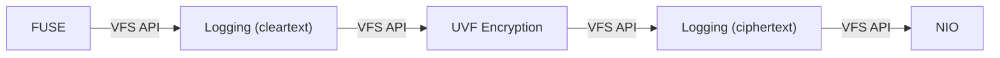

# vfs-test

Executable wiring for manual end-to-end testing.

```mermaid
flowchart LR
    FUSE -->|VFS API| LogCleartext["Logging (cleartext)"]
    LogCleartext -->|VFS API| UVF["UVF Encryption"]
    UVF -->|VFS API| LogCiphertext["Logging (ciphertext)"]
    LogCiphertext -->|VFS API| NIO
```
